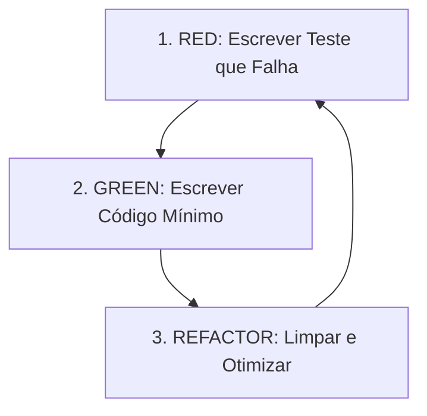

# Relatório Técnico - Implementação de TDD (Nota 6 - Avaliação N2)

Este relatório descreve a aplicação prática da metodologia de Desenvolvimento Guiado por Testes (TDD) no desenvolvimento da funcionalidade central de **Cadastro de Usuário e Atualização de Perfil** para o projeto **BookHub**, estruturado exclusivamente como uma **REST API pura (sem frontend)**.

---

## 1. Funcionalidade Escolhida e Regras de Negócio

A funcionalidade selecionada para a aplicação do ciclo TDD foi o **Cadastro de Usuário (Registro)** e a **Atualização de Perfil de Usuário**, mapeada a partir dos requisitos do projeto.

### Regras de Negócio Implementadas:
*   **RN01 - Unicidade de Credenciais (E-mail único)**: Não é permitido o cadastro de dois usuários com o mesmo e-mail. Adicionalmente, aplicamos a mesma regra para o nome de usuário (username).
*   **RN02 - Complexidade de Senha**: A senha deve possuir no mínimo 8 caracteres, devendo conter obrigatoriamente letras e números em sua composição.
*   **Consistência de Dados**: 
    *   Campos obrigatórios: e-mail, nome de usuário, senha.
    *   O e-mail deve ter um formato válido (ex: `usuario@dominio.com`).
    *   O nome de usuário deve possuir entre 3 e 50 caracteres.
    *   As senhas informadas no campo `password` e `confirmPassword` devem ser idênticas.

---

## 2. Aplicação do Ciclo TDD (Red-Green-Refactor)

O desenvolvimento da camada de serviço (`user.service.js`) foi inteiramente guiado pelo ciclo TDD:



1.  **RED**: Inicialmente, escrevemos um teste na suíte de testes unitários que descrevia o comportamento esperado da validação (por exemplo, lançar um erro se a senha não contivesse letras). Ao executar `npm test`, o teste falhava pois a lógica correspondente no arquivo de produção ainda não existia.
2.  **GREEN**: Em seguida, escrevemos a lógica mínima necessária dentro da função `register` no arquivo `user.service.js` para fazer com que o teste passasse com sucesso.
3.  **REFACTOR**: Com o teste passando (Verde), revisamos o código em busca de redundâncias, limpando expressões regulares e melhorando a organização dos lançamentos de exceção. Rodamos a suíte de testes novamente para garantir que a refatoração não quebrou nenhuma funcionalidade.

---

## 3. Detalhes de Casos de Teste Unitários

Foram desenvolvidos **15 testes unitários** no total na camada de serviço (`user.service.test.js`), utilizando mocks com a ferramenta Vitest (`vi.fn()`) para isolar completamente a camada de serviço das dependências do banco de dados (Sequelize). A seguir, detalhamos 3 testes chaves desenvolvidos:

### Exemplo 1: Validação de Sucesso no Cadastro
*   **Caso de Teste**: `deve cadastrar um usuário com sucesso quando todos os dados são válidos`
*   **O que verifica**: Valida se a função de serviço `register` executa todo o fluxo de validações sem lançar exceções quando os dados recebidos são válidos, chama o método `create` do modelo Sequelize exatamente uma vez e retorna uma mensagem de sucesso acompanhada dos dados do usuário (excluindo a senha por razões de segurança).
*   **Mocks Utilizados**: 
    *   `mockUserModel.findOne` resolvendo em `null` (indicando e-mail e username livres).
    *   `mockUserModel.create` resolvendo no objeto do usuário cadastrado.

### Exemplo 2: Validação de Complexidade de Senha (RN02)
*   **Caso de Teste**: `deve retornar erro se a senha não contiver números`
*   **O que verifica**: Garante o cumprimento da regra **RN02**. Se o usuário tentar se cadastrar com uma senha que possua mais de 8 caracteres porém contenha apenas letras (ex: `PasswordOnly`), o serviço interceptará e lançará um erro com a mensagem `'A senha deve conter pelo menos uma letra e um número.'`.
*   **Asserção**: `await expect(userService.register(invalidData, mockUserModel)).rejects.toThrow('A senha deve conter pelo menos uma letra e um número.');`

### Exemplo 3: Validação de Unicidade do E-mail (RN01)
*   **Caso de Teste**: `deve retornar erro se o e-mail já estiver cadastrado`
*   **O que verifica**: Garante o cumprimento da regra **RN01**. Simula um cenário onde um e-mail idêntico ao informado no cadastro já existe no banco de dados. O serviço deve impedir o cadastro e lançar um erro com a mensagem `'Este e-mail já está cadastrado.'`.
*   **Mocks Utilizados**: 
    *   `mockUserModel.findOne` configurado para retornar um objeto com o e-mail existente.

---

## 4. Resultados da Suíte de Testes
Toda a suíte de testes (composta por 15 testes da camada de serviço, 5 testes de integração HTTP do controller, 1 teste de saúde/health check, e 12 testes unitários adicionais de validação de estrutura dos modelos Book, Category, Favorite, ReadingHistory e Rating) roda e passa com êxito:

```bash
> bookhub-app@1.0.0 test
> vitest --run

 RUN  v3.2.4 C:/Users/Cliente/Desktop/projetos/bookhub

 ✓ src/modules/health/__tests__/health.service.test.js (1 test) 4ms
 ✓ src/modules/user/__tests__/user.service.test.js (15 tests) 17ms
 ✓ src/modules/book/__tests__/book.model.test.js (3 tests) 3ms
 ✓ src/modules/favorite/__tests__/favorite.model.test.js (2 tests) 3ms
 ✓ src/modules/user/__tests__/user.controller.test.js (5 tests) 59ms
 ✓ src/modules/history/__tests__/history.model.test.js (2 tests) 4ms
 ✓ src/modules/rating/__tests__/rating.model.test.js (3 tests) 4ms
 ✓ src/modules/category/__tests__/category.model.test.js (2 tests) 3ms

 Test Files  8 passed (8)
      Tests  33 passed (33)
```
